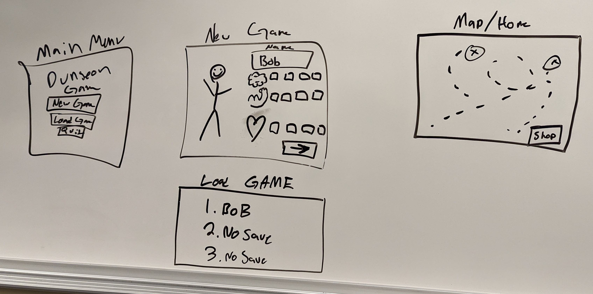

NOTE: This is intended to be merged with design documentation from the others working on this project!

# Design Specification Documenation

> This document should one for one describe how each requirement will be met through implementation details. Where appropriate provide graphics (e.g., mock-ups) that show what an interface should look like. In the coming days, we will also discuss different types of ways of describing interactions (e.g., data flow diagrams, swim lanes, sequence diagrams) which might be useful to include, as well.

1. Implement a base start screen class that will guide the player in their journey. This start screen will consist of buttons that will prompt them for a "New Game", "Load Game", "Instructions", and "Quit".  Other important screens will be the world map and town. The world map will help the player navigate through the gameplay loop. It will have buttons to go into dungeons to start combat, and a button to go to the shop to allow the player to buy potions to give their character effects. *See picture at end of document for early mockups of what these screens would look like*
    1.  We will use a driver class that will help in providing a smoother user experience. This will be where the buttons on the start screen call to, allowing them to move to the character creation screen, load game screen, and the instructions screen.
    2.  These buttons will call to the driver to help guide the player to where they need to go.
    3.  The character screen will be accesed from a button on the world map. This screen will show the player a brief rundown of thier character (name, stats, equipment, potion belt, gold, etc.) 
2.  
    1.  
    2.  
        1.  
        2.  
            1.  
            2.  
3.  
    1.  
4.  
    1.  
    2.  
    3.  
5. Implement a dungeon class which will load a corresponding screen from the driver class, combat functions will run in the combat class which will simulate combat based on the character and randomly selected monsters stats.
    1. The button on the world map will perform a check on player status before moving to the dungeon
        1. There will be multiple functions in the Dungeon class to initialize each dungeon.
        2. We will make a list of available monsters that the dungeon class will select from.
    2. The character screen or dungeon screen will have a button to control magic use, when the player characters attack function runs, it will check selection and run relevant functions.
        1. There will be a function for offensive spell use, and a function for healing spell use, this function will use a dice roll, the players current mana and the players brain stat to decide if a spell is cast, and how powerful the affect, and then will apply the health or damage, and drain the mana.
    3. The combat class will call the dice class and get stats from the player and monster.
        1. The combat class will check if either player or monster is dead between each attack, calling in a loop until combat is exited from a death or the player running.
    4.  
    5. There is a "isAwake" flag in the playerCharacter class, that is checked, and when set to false starts a timer which is removed and the flag reset in the potion drinking function
        1. When the players awake flag is triggered to false, it will also kick the player back to the world map in the same function call.
    6. TThe combat class upon monster death will call a function to award gold based on monster, and another function that will use a dice function to determine if the player gets a +1 to an equipment slot.
        1. The combat function after doing rewards, and checking combat flags, will call a function to generate a new monster and enter back into combat loop.
    7. There will be a button to exit the dungeon.
        1. The function for the button will set a flag that combat will check before loading the next monster, and if set, will kick the player back to the world map.
        2. The combat loop will call the screen change function in the driver to the world map
6.  
    1.  
        1.  
        2.  

# Images
 - This image is from an early meeting where we were planning out what screens we needed and what they needed to have on them.
 
